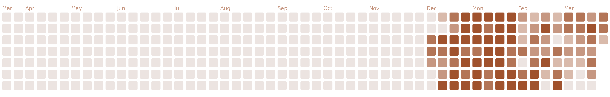
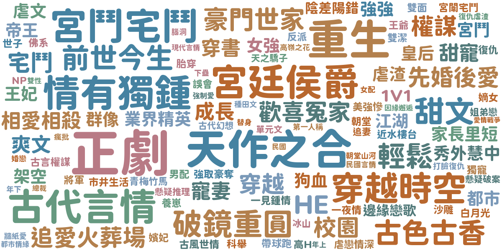

# Notion Visualizer

Generate beautiful visualisations of your habits from a Notion database.

1.  **Heatmap**: A GitHub-contribution-style heatmap of your daily duration.
2.  **Yearly Word Cloud**: A word cloud of your tags, filtered by year.

## Output Examples

### Heatmap


### Word Cloud (2025)


## Setup

### 1. Notion Integrations
1.  Create a Notion Integration at [https://www.notion.so/my-integrations](https://www.notion.so/my-integrations).
2.  Get the `Internal Integration Secret` (Token).
3.  **Share** your Database(s) with this integration (Three dots > Connect to > Select your integration).
4.  Get the `Datasource ID` (Database ID) from your database URL.

### 2. Environment Variables (.env)
Create a `.env` file or set these secrets in your GitHub repository:

| Variable | Description | Required For |
| :--- | :--- | :--- |
| `NOTION_TOKEN` | Your Notion Integration Secret. | Both |
| `NOTION_DATASOURCE_ID` | Database ID for the Heatmap data. | Heatmap |
| `NOTION_DATE_PROP` | Property name for Date (e.g., "Date"). | Heatmap |
| `NOTION_DURATION_PROP` | Property name for Duration (Number/Rollup, e.g., "Time"). | Heatmap |
| `NOTION_YEAR_DATASOURCE_ID`| Database ID for the Word Cloud data. | Word Cloud |
| `TAGS_PROP` | Property name for Tags (Select/Multi-select/Formula, e.g., "Tags"). | Word Cloud |
| `YEAR_PROP` | Property name for Year (Number/Select/Title/Formula, e.g., "Year"). | Word Cloud |
| `TARGET_YEAR` | (Optional) Specific year to filter for (e.g., "2026"). Defaults to current year. | Word Cloud |

## Usage

### Local Development

1.  **Install Dependencies**:
    ```bash
    pip install -r requirements.txt
    ```

2.  **Generate Heatmap**:
    ```bash
    python src/generate_heatmap.py
    ```
    -   Generates: `public/heatmap.png`, `public/heatmap.html`

3.  **Generate Word Cloud**:
    ```bash
    # Optionally set target year
    # export TARGET_YEAR=2025  
    python src/generate_wordcloud.py
    ```
    -   **If `TARGET_YEAR` is set** (e.g., 2025): Generates `public/word_cloud_2025.png`.
    -   **If `TARGET_YEAR` is unset**: Generates `public/word_cloud.png` (using current year data).

## Credits
Start from [broodfish/Notion-Visualizer](https://github.com/broodfish/Notion-Visualizer).
